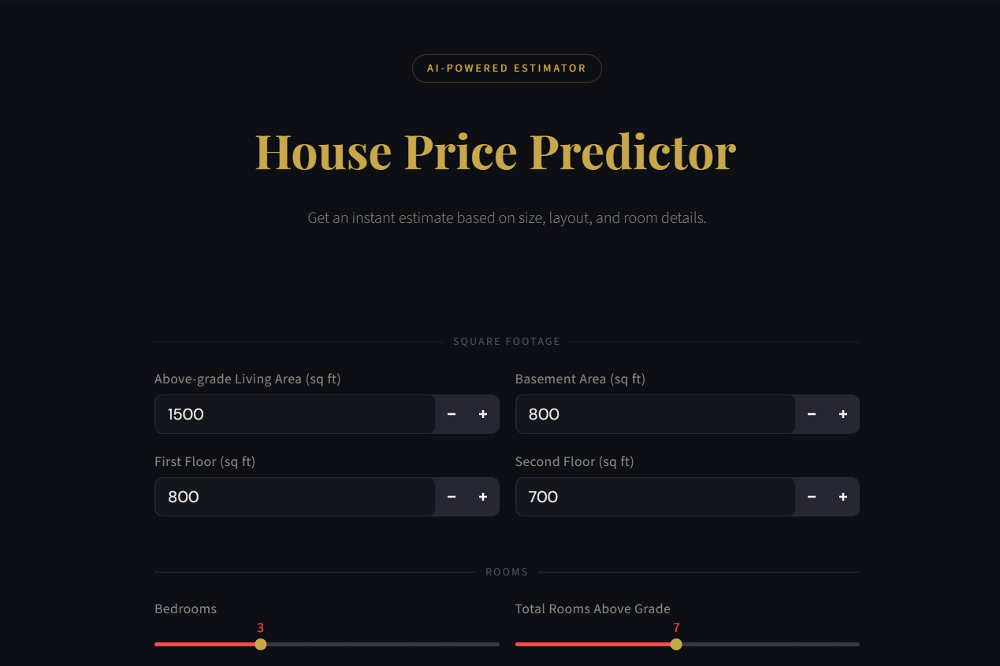
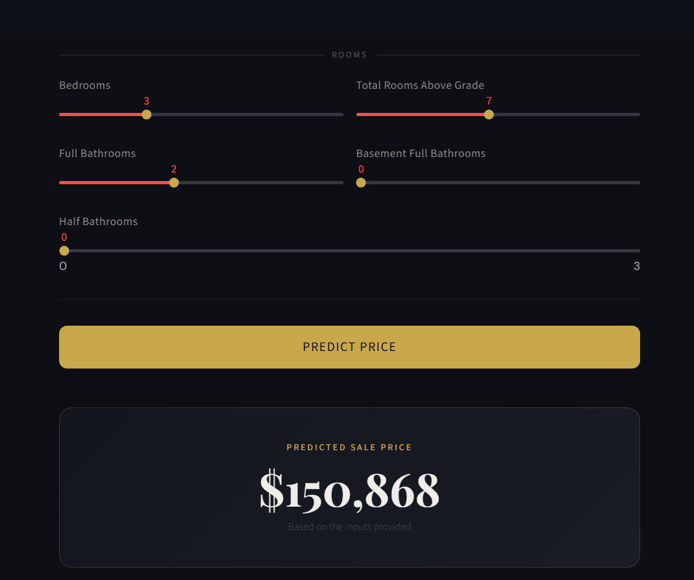

# 🏠 House Price Predictor

[](https://your-app-url.streamlit.app)

A machine learning web app that predicts house sale prices using a Linear Regression model trained on the [Ames Housing Dataset](https://www.kaggle.com/c/house-prices-advanced-regression-techniques).

---
## 📊 Model Training & Analysis

View the full training notebook with outputs, charts, and evaluation metrics:

- [View on GitHub](./main.ipynb)

## 🖼️ App Preview
<p align="center">
  
</p>

<p align="center">
  
</p>

## Features
- Predicts sale price from square footage and room details
- Clean dark-themed UI built with Streamlit
- CLI mode via `predict.py` for quick testing

## Project Structure

```
house-price-prediction/
├── data/               # Raw CSVs (not pushed to git)
├── model/              # Saved model artifacts
│   ├── model.pkl
│   ├── scaler.pkl
│   └── features.pkl
├── app.py              # Streamlit web app
├── predict.py          # CLI predictor
├── main.ipynb          # Training notebook
└── requirements.txt
```

## Run Locally

```bash
git clone https://github.com/Darshan-2118/SCT_ML_01.git
cd SCT_ML_01
python -m venv venv
venv\Scripts\activate
pip install -r requirements.txt
streamlit run app.py
```

## Deploy on Streamlit Cloud

1. Push the repo to GitHub (make sure `model/*.pkl` is **not** in `.gitignore`)
2. Go to [share.streamlit.io](https://share.streamlit.io)
3. Connect your repo → set `app.py` as the entry point
4. Click **Deploy**

## Model
- **Algorithm**: Linear Regression
- **Target**: `log(SalePrice)` → exponentiated at prediction time
- **Features**: `GrLivArea`, `TotalBsmtSF`, `1stFlrSF`, `2ndFlrSF`, `BedroomAbvGr`, `FullBath`, `HalfBath`, `BsmtFullBath`, `TotRmsAbvGrd`, `TotalSqFt`, `TotalBaths`

